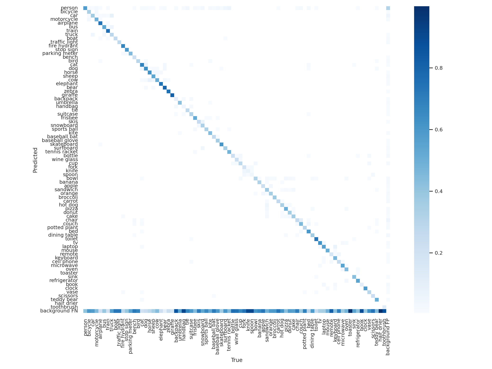

# 混淆矩陣與分類策略分析報告

## 1. 問題背景

在設計 1B4H (1 Backbone 4 Heads) 架構時，如何將 80 個 COCO 類別分配到 4 個 Head？

### 1.1 三個平衡因素

| 因素 | 影響 | 重要性 |
|------|------|--------|
| **類別獨立性（反混淆）** | 混淆類別放同一 Head 會在 softmax 中競爭 | ⭐⭐⭐ 最重要 |
| **樣本數平衡** | 樣本少的類別學不好，梯度被稀釋 | ⭐⭐ 重要 |
| **類別數平衡** | 只影響 Head 輸出層大小 | ⭐ 不太重要 |

### 1.2 關鍵結論

```
重要性排序：類別獨立性 >> 樣本數平衡 > 類別數平衡
```

---

## 2. COCO 資料集統計

### 2.1 樣本數分佈（極度不平衡）

| 類別 | bbox 數量 | 佔比 |
|------|-----------|------|
| person | 262,465 | **30.52%** |
| car | 43,867 | 5.10% |
| chair | 38,491 | 4.48% |
| ... | ... | ... |
| toaster | 225 | 0.03% |
| hair drier | 198 | 0.02% |

**極端差距：person 是 hair drier 的 1,325 倍！**

### 2.2 樣本數分佈圖

```
person      ████████████████████████████████ 30.5%
car         █████ 5.1%
chair       ████ 4.5%
book        ███ 2.9%
bottle      ███ 2.8%
cup         ██ 2.4%
...
toaster     ▏ 0.03%
hair drier  ▏ 0.02%
```

---

## 3. 混淆矩陣分析

### 3.1 1B1H 500ep 混淆矩陣



### 3.2 高混淆類別對（必須分到不同 Head）

| 混淆對 | 混淆程度 | 原因 |
|--------|----------|------|
| car ↔ truck | 🔴 高 | 形狀相似，都是車輛 |
| bicycle ↔ motorcycle | 🔴 高 | 兩輪交通工具 |
| cat ↔ dog | 🔴 高 | 四足寵物 |
| sheep ↔ cow | 🔴 高 | 農場動物 |
| fork ↔ knife ↔ spoon | 🔴 高 | 餐具三件套 |
| wine glass ↔ cup | 🔴 高 | 都是容器 |
| apple ↔ orange | 🔴 高 | 圓形水果 |
| chair ↔ couch | 🔴 高 | 座椅類 |
| mouse ↔ remote | 🔴 高 | 小型手持物品 |
| cell phone ↔ remote | 🔴 高 | 長方形手持物品 |
| microwave ↔ oven | 🔴 高 | 廚房電器 |
| skis ↔ snowboard | 🔴 高 | 雪上運動器材 |
| backpack ↔ handbag | 🔴 高 | 背包/手提包 |
| bus ↔ truck | 🟡 中 | 大型車輛 |
| car ↔ bus | 🟡 中 | 車輛 |
| couch ↔ bed | 🟡 中 | 大型家具 |
| horse ↔ cow | 🟡 中 | 大型動物 |

---

## 4. 反混淆分類策略

### 4.1 設計原則

1. **高混淆類別必須分開**：不能放在同一個 Head
2. **樣本數盡量平衡**：各 Head 的 bbox 總數接近
3. **類別數次要考慮**：不需要完全平均

### 4.2 演算法

```python
# 貪婪圖著色演算法
1. 建立衝突圖：混淆對之間連邊
2. 按樣本數排序（從多到少）
3. 對每個類別：
   a. 找出所有無衝突的 Head
   b. 選擇樣本數最少的 Head 放入
   c. 如果所有 Head 都有衝突，放入樣本最少的（犧牲反混淆）
```

### 4.3 分類結果

| Head | 類別數 | 樣本數 | 佔比 | 主要類別 |
|------|--------|--------|------|----------|
| **Head 0** | 1 | 262,465 | 30.5% | person (獨佔) |
| **Head 1** | 26 | 199,806 | 23.2% | car, motorcycle, airplane, bird, horse... |
| **Head 2** | 26 | 198,854 | 23.1% | bus, cat, sheep, chair, cup, knife... |
| **Head 3** | 27 | 198,876 | 23.1% | bicycle, truck, dog, cow, fork, apple... |

### 4.4 詳細分配

#### Head 0: Person 專用 (1 類)
```
person
```
> person 佔 30.5% 樣本，獨立一個 Head 專門處理

#### Head 1: 26 類
```
car, motorcycle, airplane, parking meter, bench, bird, horse,
elephant, bear, handbag, skis, wine glass, spoon, sandwich,
orange, hot dog, pizza, couch, potted plant, dining table,
laptop, oven, refrigerator, clock, teddy bear, toothbrush
```

#### Head 2: 26 類
```
bus, boat, traffic light, stop sign, cat, sheep, zebra, giraffe,
snowboard, sports ball, kite, baseball glove, skateboard, surfboard,
cup, knife, carrot, donut, chair, bed, mouse, cell phone,
microwave, sink, vase, hair drier
```

#### Head 3: 27 類
```
bicycle, train, truck, fire hydrant, dog, cow, backpack, umbrella,
tie, suitcase, frisbee, baseball bat, tennis racket, bottle, fork,
bowl, banana, apple, broccoli, cake, toilet, tv, remote,
keyboard, toaster, book, scissors
```

### 4.5 反混淆驗證

✅ **所有 19 對高混淆類別都已分開！**

| 混淆對 | Head 分配 | 狀態 |
|--------|-----------|------|
| car ↔ truck | Head 1 ↔ Head 3 | ✅ |
| bicycle ↔ motorcycle | Head 3 ↔ Head 1 | ✅ |
| cat ↔ dog | Head 2 ↔ Head 3 | ✅ |
| sheep ↔ cow | Head 2 ↔ Head 3 | ✅ |
| fork ↔ knife | Head 3 ↔ Head 2 | ✅ |
| knife ↔ spoon | Head 2 ↔ Head 1 | ✅ |
| fork ↔ spoon | Head 3 ↔ Head 1 | ✅ |
| chair ↔ couch | Head 2 ↔ Head 1 | ✅ |
| ... | ... | ✅ |

---

## 5. 樣本平衡度分析

### 5.1 各 Head 樣本數

```
Head 0: 262,465 (30.5%) ████████████████████████████████
Head 1: 199,806 (23.2%) ████████████████████████
Head 2: 198,854 (23.1%) ████████████████████████
Head 3: 198,876 (23.1%) ████████████████████████
```

### 5.2 平衡度指標

- **最大樣本數**: 262,465 (Head 0)
- **最小樣本數**: 198,854 (Head 2)
- **最大/最小比例**: 1.32x ✅ 可接受

### 5.3 person 問題

person 類別佔 30.5%，導致：
- 若與其他類別合併，該 Head 樣本數會過高
- 獨立一個 Head 可讓其他 3 個 Head 更平衡 (23.1-23.2%)

---

## 6. 與現有分類策略比較

| 策略 | 類別數 | 樣本數平衡 | 反混淆 | 設計依據 |
|------|--------|------------|--------|----------|
| **Standard** | 20/20/20/20 | ❌ 不平衡 | ❌ 未考慮 | 人為語意分類 |
| **Geometry** | 依長寬比 | ❌ 不平衡 | ❌ 部分考慮 | bbox 幾何特徵 |
| **Hybrid Balanced** | 15/25/25/15 | 🟡 部分平衡 | 🟡 部分考慮 | 幾何+共現頻率 |
| **AntiConfusion** | 1/26/26/27 | ✅ 1.32x | ✅ 100% 分開 | 混淆矩陣+樣本數 |

---

## 7. YAML 設定檔

```yaml
# coco_320_1b4h_anticonfusion.yaml
nc: 80
heads: 4
grouping: anticonfusion

head_assignments:
  head_0:
    name: "Person_Specialist"
    classes: [0]
    nc: 1
    sample_count: 262465
    weight: 1.0
    comment: "person 獨佔，處理 30.5% 樣本"

  head_1:
    name: "AntiConfusion_Group_1"
    classes: [2, 3, 4, 12, 13, 14, 17, 20, 21, 26, 30, 40, 44, 48, 49, 52, 53, 57, 58, 60, 63, 69, 72, 74, 77, 79]
    nc: 26
    sample_count: 199806
    weight: 1.0

  head_2:
    name: "AntiConfusion_Group_2"
    classes: [5, 8, 9, 11, 15, 18, 22, 23, 31, 32, 33, 35, 36, 37, 41, 43, 51, 54, 56, 59, 64, 67, 68, 71, 75, 78]
    nc: 26
    sample_count: 198854
    weight: 1.0

  head_3:
    name: "AntiConfusion_Group_3"
    classes: [1, 6, 7, 10, 16, 19, 24, 25, 27, 28, 29, 34, 38, 39, 42, 45, 46, 47, 50, 55, 61, 62, 65, 66, 70, 73, 76]
    nc: 27
    sample_count: 198876
    weight: 1.0
```

---

## 8. 預期效果

### 8.1 優勢

1. **減少類別混淆**：所有高混淆對都分開，不再在同一 Head 內競爭
2. **樣本數平衡**：Head 1/2/3 幾乎完全平衡（23.1%）
3. **person 專精**：最大類別獨立處理，避免壓制其他類別

### 8.2 潛在風險

1. **Head 0 只有 1 類**：可能導致該 Head 過度擬合
2. **person 與其他類別的互動**：person 與其他物件（如 backpack, umbrella）的共現關係可能丟失

### 8.3 建議實驗

| 實驗 | 設定 | 目的 |
|------|------|------|
| **AntiConfusion v1** | 如上 YAML | 驗證反混淆效果 |
| **AntiConfusion v2** | person + 少量配件 | 測試 person 合併效果 |

---

## 9. 結論

1. **反混淆是 1B4H 的核心優勢**：把容易混淆的類別分開，讓各 Head 獨立判斷
2. **樣本數平衡次重要**：1.32x 的差距可接受
3. **類別數不需平衡**：1/26/26/27 的分佈沒問題
4. **person 獨立處理**：因為佔 30.5% 樣本，獨立一個 Head 是合理的

---

## 10. 下一步

1. 建立 `data/coco_320_1b4h_anticonfusion.yaml`
2. 在 vast.ai 上訓練 500 epochs
3. 與其他分類策略比較 mAP@0.5

---

*報告生成時間: 2025-12-02*
*基於 1B1H 500ep 訓練結果分析*
